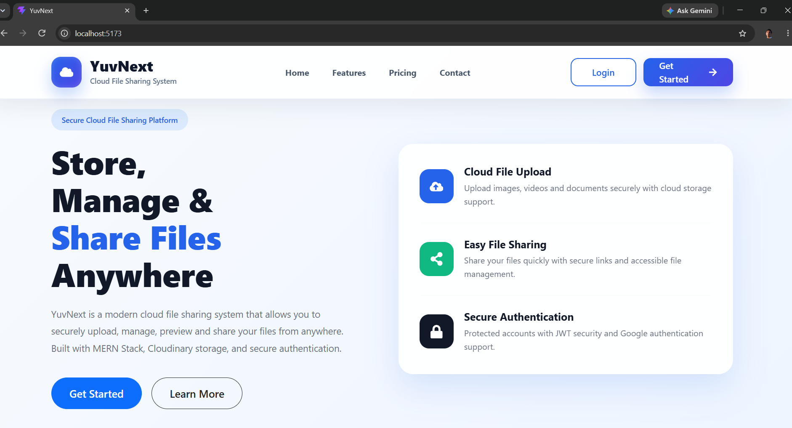
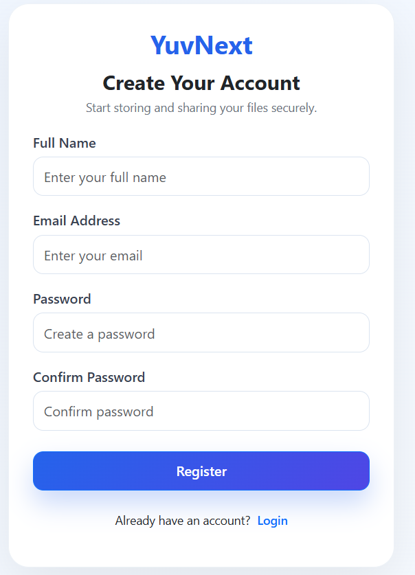
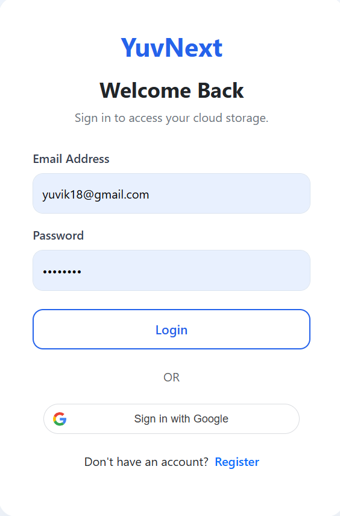
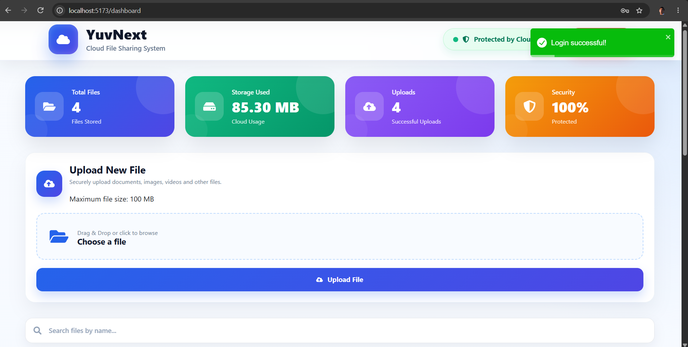
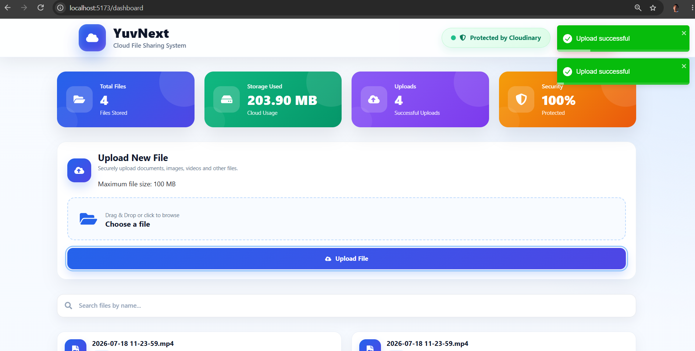

# YuvNext - Cloud File Sharing System

YuvNext is a secure cloud file sharing system that allows users to upload, manage, download, and share files through a modern web-based platform.

The system is built using the MERN Stack with Cloudinary integration for reliable cloud file storage and JWT authentication for secure user access.

## Features

- User registration and login
- JWT-based authentication
- Secure cloud file upload
- Cloudinary file storage integration
- File download and management
- Search uploaded files
- Responsive dashboard interface
- Secure user-specific file access
- Modern SaaS-style landing page

## Technologies Used

### Frontend

- React.js
- Vite
- Bootstrap
- CSS3
- React Router
- React Icons
- Axios

### Backend

- Node.js
- Express.js
- MongoDB
- Mongoose
- JWT Authentication
- Bcrypt.js

### Cloud Services

- Cloudinary

## Screenshots

### Home Page



### Register Page



### Login Page



### Dashboard



### Upload File



## Project Structure

```
cloud-file-sharing-system
│
├── client
│   ├── src
│   └── package.json
│
├── server
│   ├── controllers
│   ├── models
│   ├── routes
│   └── server.js
│
└── screenshots
```

## Installation

### Clone Repository

```bash
git clone https://github.com/Yuvraj-Dhakal/cloud-file-sharing-system.git
```

## Frontend Setup

```bash
cd client
npm install
npm run dev
```

## Backend Setup

```bash
cd server
npm install
npm start
```

## Environment Variables

Create a `.env` file inside the server folder:

```
PORT=5000
MONGO_URI=your_mongodb_connection
JWT_SECRET=your_secret_key

CLOUDINARY_CLOUD_NAME=your_cloud_name
CLOUDINARY_API_KEY=your_api_key
CLOUDINARY_API_SECRET=your_api_secret
```

## Future Improvements

- File sharing using public links
- Password protected files
- File expiration system
- Storage analytics
- Payment integration
- Advanced user plans

## Author

**Yuv Raj Dhakal**

B.Sc. CSIT Student

GitHub:
https://github.com/Yuvraj-Dhakal

LinkedIn:
https://www.linkedin.com/in/yuv-raj-dhakal-603514308